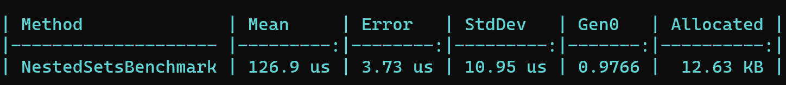

# Database Access Benchmarking Project

This repository contains three projects designed to benchmark different database access strategies for hierarchical data management: Nested Sets, Path Enumeration, and Closure Tables. Each project demonstrates a unique approach to managing and querying hierarchical relationships in a database. This guide will help you get started with initializing and running benchmarks for these projects.

## Getting Started

Before running the benchmarks, ensure that each database project is properly set up. Follow the steps below to initialize the databases for `NestedSetsAccess`, `PathBasedAccess`, and `ClosureTableAccess`.

### Prerequisites

- .NET SDK (compatible with the projects)
- SQL Server (LocalDB or full version, depending on your setup)
- Visual Studio or suitable IDE with Package Manager Console

### Database Initialization

1. **Open the Solution in Visual Studio**: Start by opening the solution file that contains all three projects.

2. **Update the Database for Each Project**: For each project (`NestedSetsAccess`, `PathBasedAccess`, `ClosureTableAccess`), you need to update the database using Entity Framework migrations. This step creates the database schema needed for each project. Use the Package Manager Console in Visual Studio for this purpose. Run the following command for each project:

    ```powershell
    Update-Database -ProjectName <ProjectName>
    ```
    Replace `<ProjectName>` with `NestedSetsAccess`, `PathBasedAccess`, or `ClosureTableAccess` accordingly.

3. **Ensure the Databases are Updated**: After running the commands, check your SQL Server instance to ensure that the databases for each project have been created and are up-to-date with the latest schema.

## Running the Benchmark

After setting up the databases, you can run the benchmark tests to measure and compare the performance of each access strategy. 

### Benchmark Project

The `DatabaseBenchmarking` project contains benchmarks for each access method. 

### Running the Benchmark Without a Debugger

To get accurate benchmark results, it's crucial to run the benchmark without the debugger attached. Follow these steps:

1. **Open a Command Prompt or Terminal**: Navigate to the directory containing the `DatabaseBenchmarking` project.

2. **Build the Benchmark Project**: Run the following command to build the project in Release mode:

    ```shell
    dotnet build -c Release
    ```

3. **Run the Benchmark**: Execute the benchmark by running the following command:

    ```shell
    dotnet run -c Release --project DatabaseBenchmarking
    ```

Running the benchmarks in Release mode without the debugger ensures that you get the most accurate performance measurements.

### Benchmark Results

#### Used Hardware

- **Operating System**: Windows 11
- **CPU**: Intel Xeon E-2186M, 2.90GHz
- **Cores**: 6 physical, 12 logical
- **Benchmark Tool**: BenchmarkDotNet v0.13.12

#### Performance Analysis

- **Nested Sets Benchmark**: Exhibited a mean execution time of 126.9 microseconds, with moderate memory allocation. This method balances speed and resource usage efficiently for hierarchical data management.



- **Path-Based Benchmark**: Recorded a mean execution time of 251.1 microseconds, with higher memory allocation. This method's increased resource utilization suggests it may be less efficient for applications requiring rapid access or large-scale implementations.


- **Closure Table Benchmark**: Demonstrated the best performance with the lowest mean execution time of 104.1 microseconds and minimal resource allocation. This approach is highly efficient, offering quick access and low memory usage, making it ideal for high-performance applications.


#### Conclusion

The Closure Table method emerges as the most efficient for checking parent-to-child access, with the fastest execution and least memory overhead. It is the preferable option for applications prioritizing performance and efficiency. The Path-Based method, while simple, may not suit performance-critical applications due to its slower speed and higher resource consumption. The Nested Sets approach provides a balanced solution, suitable for various applications by compromising between performance and complexity.
